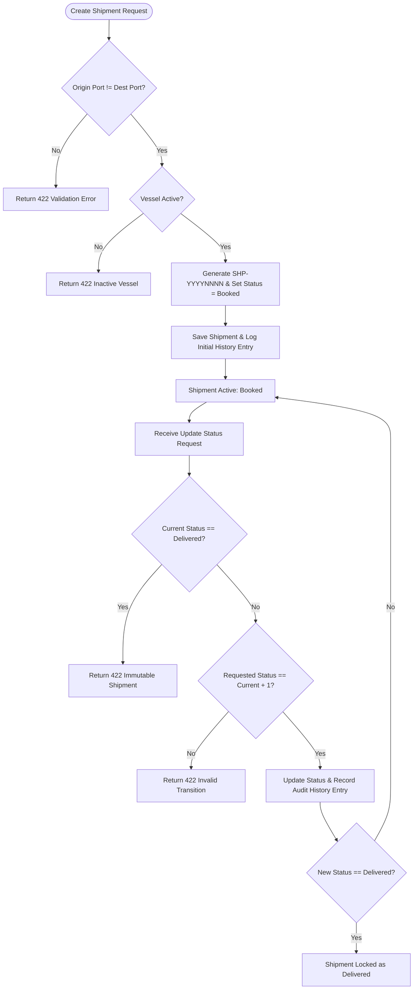
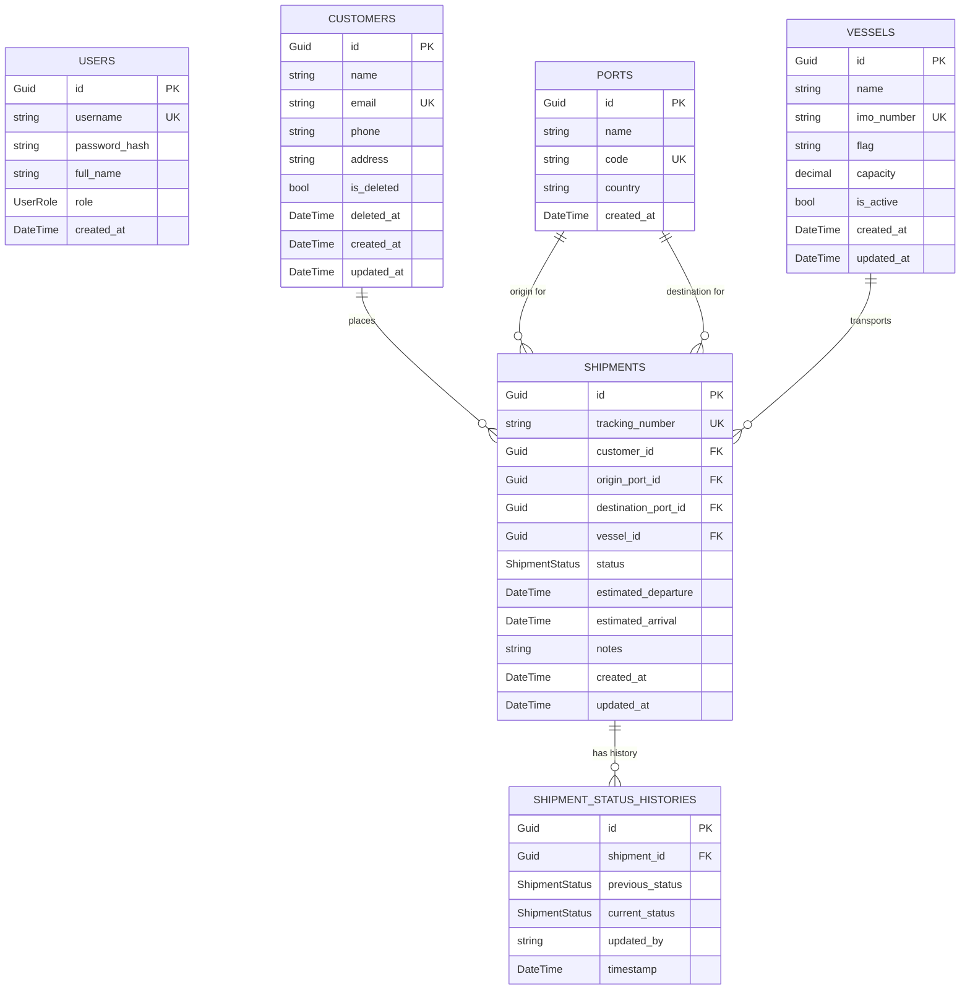
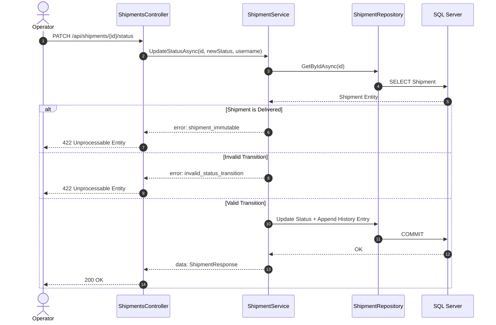

# Product Requirements Document (PRD) — ShipSharp API

## 1. Introduction

The **ShipSharp API** is an enterprise-grade backend system built with ASP.NET Core 8 and Entity Framework Core 8. It enables logistics operators and administrators to manage sea freight shipment operations, maintain vessel and port master data, process customer records, enforce strict shipment status progression workflows, and provide public shipment tracking for end-customers.

The system follows **Layer-First Clean Architecture** with **feature-based folder organization**, ByJSON response conventions, structured logging, audit trails, and comprehensive test coverage.

---

## 2. Goals

- Provide a secure, RESTful API for managing sea freight shipping operations.
- Enforce business logic governing shipment status transitions, port validations, vessel assignments, and record immutability.
- Maintain immutable audit logs for every shipment status change.
- Provide a public, unauthenticated tracking endpoint via unique tracking numbers (`SHP-YYYYNNNN`).
- Ensure high code quality, testability, and clean separation of concerns using 4-layer Clean Architecture.

---

## 3. User Stories

### User Story 1: Operator / Admin Authentication

- **As an** Operator or Admin, **I want to** log in with username and password, **so that** I obtain a JWT token to perform authorized operations.

### User Story 2: Customer Management

- **As an** Operator or Admin, **I want to** create, search, update, and soft-delete customer profiles, **so that** customer data is maintained without losing historical records.

### User Story 3: Master Data Management (Ports & Vessels)

- **As an** Admin, **I want to** register port master data and manage fleet vessels, **so that** valid ports and active vessels are available for shipment creation.

### User Story 4: Shipment Creation & Management

- **As an** Operator, **I want to** create shipments with assigned customers, ports, vessels, and schedules, **so that** each shipment receives a tracking number (`SHP-YYYYNNNN`) and starts at `Booked` status.

### User Story 5: Shipment Status Advancement

- **As an** Operator, **I want to** advance shipment status sequentially through the lifecycle, **so that** each transition is logged immutably with timestamp and operator metadata.

### User Story 6: Customer Shipment Tracking

- **As a** Customer, **I want to** look up my shipment by tracking number without logging in, **so that** I can view current status, ETA, and history timeline.

---

## 4. Functional Requirements

### 4.1 Authentication & Authorization

1. `POST /api/auth/login` — authenticate with username + password, return JWT token.
2. JWT MUST include claims: `UserId`, `Username`, `FullName`, `Role` (`Admin` | `Operator`).
3. RBAC:
   - **Admin**: full access including Port creation, Vessel activation/deactivation, Customer deletion.
   - **Operator**: Customer create/update, Vessel update, Shipment create/update, Status updates.
   - **Public**: tracking endpoint only.

### 4.2 Customer Management

4. CRUD + list with search (`name`, `email`) and pagination (`page`, `per_page`).
5. Soft-deletion: `is_deleted = true`, `deleted_at = timestamp`. EF Core Global Query Filters exclude soft-deleted records.

### 4.3 Port Master Data

6. Create + list ports (`name`, `code`, `country`). Port codes MUST be uppercase letters only (e.g., `SUB`, `JKT`, `SIN`).
7. Ports are immutable — no modification or deletion after creation.

### 4.4 Vessel Management

8. Create, update, activate/deactivate, list with `is_active` filter and pagination.
9. IMO numbers: `IMO` + 7 digits (e.g., `IMO9123456`). Must be unique.
10. Inactive vessels MUST NOT be assigned to shipments.

### 4.5 Shipment Core Business Logic

11. Tracking number: `SHP-YYYYNNNN`, sequential per calendar year (e.g., `SHP-20260001`).
12. New shipments default to `Booked` status.
13. Origin port ≠ Destination port.
14. `estimated_arrival` MUST be after `estimated_departure`.
15. Initial `ShipmentStatusHistory` record created automatically on shipment creation (`previous_status = null`, `current_status = Booked`).

### 4.6 Shipment Status Progression & Immutability

16. Status sequence: `Booked(0)` → `Loading(1)` → `Departed(2)` → `At Sea(3)` → `Arrived(4)` → `Delivered(5)`.
17. Must advance exactly one step at a time — no skipping, no reversal.
18. `Delivered` shipments are **immutable** — no further status or data changes.
19. Every transition appends an entry to `ShipmentStatusHistory` with `previous_status`, `current_status`, `updated_by`, `timestamp` (UTC).

### 4.7 Public Tracking

20. `GET /api/shipments/track/{tracking_number}` — no auth required.
21. Response includes: `tracking_number`, `current_status`, `estimated_arrival`, `history[]`.

### 4.8 Business Logic Flowchart



---

## 5. Non-Goals

- Frontend / mobile client (REST API only).
- Real-time IoT vessel GPS tracking.
- Billing, invoicing, or payment processing.
- Customer self-registration.
- CQRS / MediatR (out of scope).
- Rich Domain Model, Domain Events, Value Objects (out of scope).

---

## 6. Technical Guidelines

### 6.1 Architecture

**Layer-First Clean Architecture** with feature-based folder organization inside each layer.

```
Dependency Rule (enforced by .csproj references):

  API  ──►  Application  ──►  Domain
                ▲
          Infrastructure
```

- `Domain` — zero external project references.
- `Application` — references `Domain` only.
- `Infrastructure` — references `Application` (+ `Domain` transitively).
- `API` — references `Application` + `Infrastructure` (for DI wiring in `Program.cs`).

### 6.2 Project Structure

Folder names are **short** (Jason Taylor convention). Assembly names and root namespaces are **prefixed** (`ShipSharp.*`) via `.csproj`.

```text
ShipSharp/
├── src/
│   ├── Domain/                          # RootNamespace: ShipSharp.Domain
│   │   ├── Common/
│   │   │   ├── BaseEntity.cs            # Guid Id
│   │   │   └── BaseAuditableEntity.cs   # + CreatedAt, UpdatedAt
│   │   ├── Shipments/
│   │   │   ├── Shipment.cs
│   │   │   ├── ShipmentStatusHistory.cs
│   │   │   ├── ShipmentStatus.cs        (enum)
│   │   │   └── IShipmentRepository.cs
│   │   ├── Customers/
│   │   │   ├── Customer.cs
│   │   │   └── ICustomerRepository.cs
│   │   ├── Vessels/
│   │   │   ├── Vessel.cs
│   │   │   └── IVesselRepository.cs
│   │   ├── Ports/
│   │   │   ├── Port.cs
│   │   │   └── IPortRepository.cs
│   │   └── Users/
│   │       ├── User.cs
│   │       ├── UserRole.cs              (enum)
│   │       └── IUserRepository.cs
│   │
│   ├── Application/                     # RootNamespace: ShipSharp.Application
│   │   ├── Common/
│   │   │   ├── Models/
│   │   │   │   ├── ApiResponse.cs       # ByJSON envelope: { data, error, meta }
│   │   │   │   └── PagedResult.cs
│   │   │   ├── Exceptions/
│   │   │   │   ├── NotFoundException.cs
│   │   │   │   └── ForbiddenException.cs
│   │   │   └── Interfaces/
│   │   │       ├── ITokenService.cs
│   │   │       └── IPasswordService.cs
│   │   ├── Auth/
│   │   │   ├── IAuthService.cs
│   │   │   ├── AuthService.cs
│   │   │   ├── DTOs/
│   │   │   │   ├── LoginRequest.cs
│   │   │   │   └── LoginResponse.cs
│   │   │   └── Validators/
│   │   │       └── LoginRequestValidator.cs
│   │   ├── Customers/
│   │   │   ├── ICustomerService.cs
│   │   │   ├── CustomerService.cs
│   │   │   ├── DTOs/
│   │   │   └── Validators/
│   │   ├── Vessels/
│   │   │   ├── IVesselService.cs
│   │   │   ├── VesselService.cs
│   │   │   ├── DTOs/
│   │   │   └── Validators/
│   │   ├── Ports/
│   │   │   ├── IPortService.cs
│   │   │   ├── PortService.cs
│   │   │   ├── DTOs/
│   │   │   └── Validators/
│   │   ├── Shipments/
│   │   │   ├── IShipmentService.cs
│   │   │   ├── ShipmentService.cs
│   │   │   ├── DTOs/
│   │   │   │   ├── CreateShipmentRequest.cs
│   │   │   │   ├── UpdateShipmentRequest.cs
│   │   │   │   ├── UpdateShipmentStatusRequest.cs
│   │   │   │   ├── ShipmentResponse.cs
│   │   │   │   └── ShipmentTrackingResponse.cs
│   │   │   └── Validators/
│   │   │       ├── CreateShipmentRequestValidator.cs
│   │   │       └── UpdateShipmentStatusRequestValidator.cs
│   │   └── DependencyInjection.cs       # AddApplication() extension method
│   │
│   ├── Infrastructure/                  # RootNamespace: ShipSharp.Infrastructure
│   │   ├── Data/
│   │   │   ├── AppDbContext.cs
│   │   │   ├── AppDbSeeder.cs
│   │   │   └── Migrations/
│   │   ├── Shipments/
│   │   │   ├── ShipmentRepository.cs
│   │   │   └── ShipmentConfiguration.cs
│   │   ├── Customers/
│   │   │   ├── CustomerRepository.cs
│   │   │   └── CustomerConfiguration.cs
│   │   ├── Vessels/
│   │   │   ├── VesselRepository.cs
│   │   │   └── VesselConfiguration.cs
│   │   ├── Ports/
│   │   │   ├── PortRepository.cs
│   │   │   └── PortConfiguration.cs
│   │   ├── Users/
│   │   │   ├── UserRepository.cs
│   │   │   └── UserConfiguration.cs
│   │   ├── Services/
│   │   │   ├── TokenService.cs
│   │   │   └── PasswordService.cs
│   │   └── DependencyInjection.cs       # AddInfrastructure() extension method
│   │
│   └── API/                             # RootNamespace: ShipSharp.API
│       ├── Auth/
│       │   └── AuthController.cs
│       ├── Customers/
│       │   └── CustomersController.cs
│       ├── Vessels/
│       │   └── VesselsController.cs
│       ├── Ports/
│       │   └── PortsController.cs
│       ├── Shipments/
│       │   └── ShipmentsController.cs
│       ├── Middleware/
│       │   └── ExceptionHandlingMiddleware.cs
│       ├── appsettings.json
│       ├── appsettings.Development.json
│       └── Program.cs
│
├── tests/
│   └── ShipSharp.Tests/
│       ├── Unit/
│       │   ├── Shipments/
│       │   ├── Customers/
│       │   └── ...
│       └── Integration/
│           └── IntegrationTestWebAppFactory.cs
│
├── docs/
│   └── prds/
│       └── prd-main.md
├── .gitignore
├── AGENTS.md
├── README.md
└── ShipSharp.sln
```

### 6.3 Technology Stack

| Category          | Technology                                                          |
| ----------------- | ------------------------------------------------------------------- |
| Framework         | .NET 8.0 (ASP.NET Core Web API)                                     |
| ORM               | Entity Framework Core 8.0                                           |
| Database          | Microsoft SQL Server                                                |
| Validation        | FluentValidation 11.x                                               |
| Authentication    | JWT Bearer (`Microsoft.AspNetCore.Authentication.JwtBearer`)        |
| Password Hashing  | BCrypt.Net-Next                                                     |
| Logging           | Serilog (Console + Rolling File sinks)                              |
| API Documentation | **Scalar** (`Scalar.AspNetCore`) + `Microsoft.AspNetCore.OpenApi`   |
| Testing           | xUnit + Moq + FluentAssertions + `Microsoft.AspNetCore.Mvc.Testing` |
| Test DB           | SQLite In-Memory (`Microsoft.EntityFrameworkCore.Sqlite`)           |

> Scalar replaces Swashbuckle. Accessible at `/docs` in development mode.  
> Setup: `builder.Services.AddOpenApi()` + `app.MapScalarApiReference()`.

### 6.4 API Response Envelope (ByJSON)

All API responses **MUST** follow the [ByJSON](https://github.com/bayu-dev/by-json) specification.

Every response contains exactly three root-level keys:

```json
{
  "data": "...(object, array, or null)",
  "error": "...(object or null)",
  "meta": { "request_id": "...", "timestamp": "..." }
}
```

**Rules:**

| Condition | `data`          | `error` | `meta`         |
| --------- | --------------- | ------- | -------------- |
| Success   | Object or Array | `null`  | Always present |
| Error     | `null`          | Object  | Always present |

**Success — Single Object (`200 OK`):**

```json
{
  "data": {
    "id": "3fa85f64-5717-4562-b3fc-2c963f66afa6",
    "tracking_number": "SHP-20260001",
    "status": "Booked"
  },
  "error": null,
  "meta": {
    "request_id": "8f830a6e-4e8c-4a37-b6e5-22e70df4ab75",
    "timestamp": "2026-08-05T15:00:00Z"
  }
}
```

**Success — Paginated Collection (`200 OK`):**

```json
{
  "data": [{ "id": "...", "tracking_number": "SHP-20260001" }],
  "error": null,
  "meta": {
    "request_id": "...",
    "timestamp": "2026-08-05T15:00:00Z",
    "pagination": {
      "current_page": 1,
      "per_page": 10,
      "total_items": 42,
      "total_pages": 5,
      "links": {
        "self": "https://api/shipments?page=1&per_page=10",
        "next": "https://api/shipments?page=2&per_page=10",
        "prev": null,
        "first": "https://api/shipments?page=1&per_page=10",
        "last": "https://api/shipments?page=5&per_page=10"
      }
    }
  }
}
```

**Error — Validation (`422 Unprocessable Entity`):**

```json
{
  "data": null,
  "error": {
    "code": "validation_error",
    "message": "The request data is invalid.",
    "details": [
      {
        "field": "origin_port_id",
        "code": "invalid_value",
        "message": "Origin and destination ports must be different."
      }
    ]
  },
  "meta": {
    "request_id": "...",
    "timestamp": "2026-08-05T15:00:00Z"
  }
}
```

**Error — General (`400`, `401`, `403`, `404`, `500`):**

```json
{
  "data": null,
  "error": {
    "code": "not_found",
    "message": "Shipment not found."
  },
  "meta": {
    "request_id": "...",
    "timestamp": "2026-08-05T15:00:00Z"
  }
}
```

### 6.5 Naming Conventions

| Item                         | Convention            | Example                             |
| ---------------------------- | --------------------- | ----------------------------------- |
| JSON keys (request/response) | `snake_case`          | `tracking_number`, `origin_port_id` |
| Resource URLs                | plural, kebab-case    | `/shipments`, `/status-histories`   |
| C# Classes                   | PascalCase            | `ShipmentService`                   |
| Interfaces                   | `I` prefix            | `IShipmentRepository`               |
| DTOs (Request)               | `...Request` suffix   | `CreateShipmentRequest`             |
| DTOs (Response)              | `...Response` suffix  | `ShipmentResponse`                  |
| Validators                   | `...Validator` suffix | `CreateShipmentRequestValidator`    |
| Controllers                  | Plural + `Controller` | `ShipmentsController`               |
| EF Configurations            | `...Configuration`    | `ShipmentConfiguration`             |

### 6.6 Git Workflow

- Repository initialized at project root.
- Commit style: [Conventional Commits](https://www.conventionalcommits.org/) in **English**.
- Commit after each meaningful unit of work.

| Type       | When                                     |
| ---------- | ---------------------------------------- |
| `feat`     | New feature or endpoint                  |
| `fix`      | Bug fix                                  |
| `chore`    | Scaffolding, config, tooling             |
| `refactor` | Code restructure without behavior change |
| `test`     | Adding or updating tests                 |
| `docs`     | Documentation changes                    |

Example commit messages:

```
chore: initialize solution with 4-layer Clean Architecture scaffold
feat(domain): add Shipment aggregate with status history and enums
feat(application): add ShipmentService with status transition logic
feat(infrastructure): add ShipmentRepository and EF Core configurations
feat(api): add ShipmentsController with CRUD and status endpoints
test: add integration tests for shipment status progression rules
docs: add README and AGENTS.md
```

### 6.7 Database Schema



### 6.8 Status Transition Sequence Diagram



---

## 7. Endpoint Reference

| Method   | Endpoint                                 | Auth           | Description                            |
| -------- | ---------------------------------------- | -------------- | -------------------------------------- |
| `POST`   | `/api/auth/login`                        | Public         | Login and obtain JWT token             |
| `GET`    | `/api/customers`                         | Admin/Operator | List customers (paginated, searchable) |
| `POST`   | `/api/customers`                         | Admin/Operator | Create customer                        |
| `GET`    | `/api/customers/{id}`                    | Admin/Operator | Get customer by ID                     |
| `PUT`    | `/api/customers/{id}`                    | Admin/Operator | Update customer                        |
| `DELETE` | `/api/customers/{id}`                    | Admin          | Soft-delete customer                   |
| `GET`    | `/api/ports`                             | Admin/Operator | List all ports                         |
| `POST`   | `/api/ports`                             | Admin          | Create port                            |
| `GET`    | `/api/vessels`                           | Admin/Operator | List vessels (paginated, filterable)   |
| `POST`   | `/api/vessels`                           | Admin          | Create vessel                          |
| `PUT`    | `/api/vessels/{id}`                      | Admin/Operator | Update vessel                          |
| `POST`   | `/api/vessels/{id}/activate`             | Admin          | Activate vessel                        |
| `POST`   | `/api/vessels/{id}/deactivate`           | Admin          | Deactivate vessel                      |
| `GET`    | `/api/shipments`                         | Admin/Operator | List shipments (paginated)             |
| `POST`   | `/api/shipments`                         | Admin/Operator | Create shipment                        |
| `GET`    | `/api/shipments/{id}`                    | Admin/Operator | Get shipment by ID                     |
| `PUT`    | `/api/shipments/{id}`                    | Admin/Operator | Update shipment (non-Delivered only)   |
| `PATCH`  | `/api/shipments/{id}/status`             | Admin/Operator | Advance shipment status                |
| `GET`    | `/api/shipments/track/{tracking_number}` | **Public**     | Track shipment by number               |

---

## 8. Success Metrics

- 100% adherence to shipment status transition rules (no illegal skips or regressions).
- 100% audit completeness in `ShipmentStatusHistory`.
- Sub-100ms response time for public tracking queries.
- Zero unhandled exceptions leaked to callers (all caught by `ExceptionHandlingMiddleware`).
- All integration tests pass against SQLite in-memory database.

---

## 9. Open Questions

_None. All architecture, tooling, naming, response format, and scope decisions have been confirmed._
